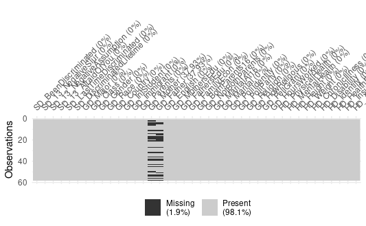
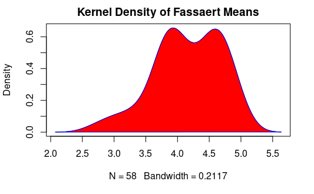
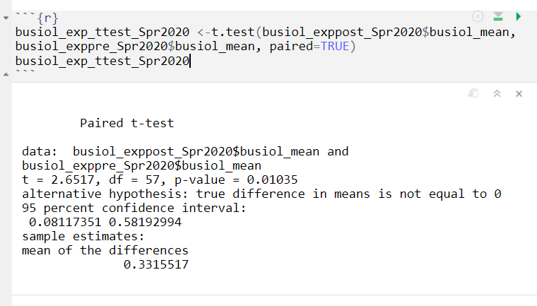
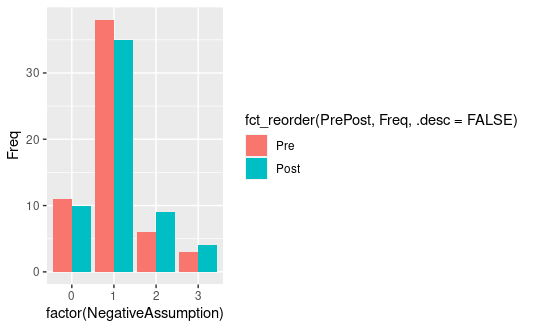
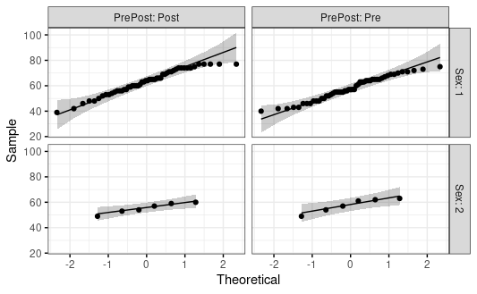

# Survey Data/Empathy Levels Research Project
Analysis of Empathy Levels with Likert Survey Data using R

## Table of Contents
* [General Info](#general-information)
* [Technologies Used](#technologies-used)
* [Setup](#setup)
* [Screenshots](#screenshots)
* [Usage](#usage)
* [Project Status](#project-status)
* [Conclusion](#conclusion)
* [Acknowledgements](#acknowledgements)


## General Information
- This project was given to my colleague Kenneth Lefin and I in our final semester together at Cal State East Bay.  This was not an assigned project from a class, this was more of an internship project from Humanities Professor Valerie Smith.

- The data given to us was survey data in a Likert Scale (1-n), and it was our job to use a programming language of our choice (R) to clean and analyze the data.  The purpose of our project was to compare the data of her Humanities Class to the data of a Control Class, and to find out whether or not her class increased her student's empathy levels.

- We used data over the course of 4 semesters (Fall 2019 - Spring 2021), and we dealt with Experimental and Control groups.  This was a lot of data, and the formatting of the responses was not consistent.  Our first goal was to edit the data so we could run tests on it.  We wanted paired data from pre-test to post-test, and there were some semesters where the responses were the content of the response, and not the response number.   Eventually, we put all the data into one dataframe so we could run tests comparing all the experimental groups combined vs all the control groups combined.

-The reason that Kenneth and I undertook this project was that we wanted to have a project that demonstrated what we had learned in our time at CSUEB in terms of statistics and using statistical analysis software.  At the same time, I personally took this project because I hope to have a career in statistics that has some kind of benefit for society.  I believe in empathy and having a culture of empathy, so if our studies can improve a teacher's ability to improve empathy, I would consider our efforts fruitful.

- Check ExampleQuestionaire and CodeSheets for examples of questions and variable names that were given to us.


## Technologies Used
- 1. Excel (To do some quick edits on the datasets before importing the data into R)
- 2. R (More specifically, rstudiocloud)
- 3. Microsoft Word (For final, condensed reports to deliver to Professor Smith)

Packages:
- Tidyverse
  - Pipe Operator: To run multiple functions on single set of data
  - ggplot2: To create visuals for exploratory data analysis.  In this case, bar charts were created.
- Visdat: To visualize NA's, so we can go back and figure out how to fill NA's for a question or section of questions.
- stats: Box Plots, T-Tests, ANOVA's


## Setup

In order to run this project, you are going to need:
- The proper .xlsx (for the data)
- The proper .txt file (to rename the columns)
- The proper .RMD's (both pre-test and post-test necessary to run everything, including comparative statistical analysis tests)
* However, the data is private, so if you would like to run this project, please contact me or Professor Valerie Smith (please contact me to get her permission.)


## Usage

Example Codes:

For distributions:
```{r}
#make sure you change the title of the plot, on top of the different variables
density_emp_mean_Exppre_Spr2020 <- density(BS_Exppre_Spr2020$empathy_mean)
plot(density_emp_mean_Exppre_Spr2020, main="Kernel Density of Empathy Means")
polygon(density_emp_mean_Exppre_Spr2020, col="red", border="blue")
```

For standard deviations and means:
```{r}
# MAKE SURE you change the dividing number by the number of rows in this data
total_mean_Exppre_Spr2020_empathy <- sum(BS_Exppre_Spr2020$empathy_mean) / 58
total_mean_Exppre_Spr2020_empathy
sd_Exppre_Spr2020_empathy_mean <- sd(BS_Exppre_Spr2020$empathy_mean)
sd_Exppre_Spr2020_empathy_mean
```

For Paired T-Tests:

```{r}
#ttest comparing the means of pre and post: empathy
empathy_Exp_Spr2020_ttest <-t.test(BS_Exppost_Spr2020$empathy_mean, BS_Exppre_Spr2020$empathy_mean, paired=TRUE)
empathy_Exp_Spr2020_ttest
```

For count plots of individual questions:

```{r}
tbl_disc_life_Spr2020 <- with(disc_life_Spr2020, table(PrePost, DiscriminatedLifetime))
ggplot(as.data.frame(tbl_disc_life_Spr2020), aes(factor(DiscriminatedLifetime), Freq, fill =fct_reorder(PrePost, Freq, .desc=FALSE))) +  
  geom_col(position = 'dodge')
```

ANOVA tests to compare pre- and post- means and how they are different by sex.

```{r}
#The following is code to run a Repeated Measures ANOVA test, comparing the empathy means to the effect of Pre or Post, the effect of gender, and the interation between PrePost and sex.  We find in this case that there is no significant interaction between PrePost and sex, so moving forward we need to  interpret the main effects for each of the two variables: prepost and sex.
BS_anovatest_Spr2020 <- anova_test(
  data = BS_exp_prepost_Spr2020, dv = empathy_total,
  between = c(PrePost, Sex))
get_anova_table(BS_anovatest_Spr2020)
```


## Screenshots


- Visdat package to show how many NA's were remaining per column.  Super useful for cleaning data.


- Example of distribution amongst one of the three scales of empathy means.  All of the distributions ended up mostly normal, and we were able to run inferential statistics from there.


- Example Paired T-Test amongst one of the three scales of empathy (check documents for full definitions).  P-Value below .05 means that there was a true difference in means not equal to zero (for the Spring 2020 experimental group).  Their empathy level, in this category, had gone up by a mean of 0.3316 (out of 7).


- Count plot for response for 'NegativeAssumption' Variable: "Someone made negative assumptions or insensitive or offensive comments about you."
1. Yes
2. No
3. Not Sure


- Check for normality when doing a Mixed-Level ANOVA, comparing Sex, Group (experimental vs control), and their interaction on the effect on a change in empathy levels.


## Project Status
Project is: No longer being worked on.
- Project has been completed and turned into to Professor Smith.  An official scholarly report is under construction.

## Conclusion
Check docx's for final results.
- Descriptive Statistics
- Paired T-Tests
  - Same Class (pretest vs posttest)
  - Combined Classes (Experimental vs Control)


## Acknowledgements
Thank you to Professors Valerie Smith, Maureen Lahiff, and Negin Toosi for the assistance.  Thank you to the entire Statistics department at Cal State East Bay for equipping us with the proper tools to learn how to break down and analyze statistics and use the proper software.

Most importantly, thank you to Kenneth Lefin for introducing me to the project, and for being an amazing partner with brilliant ideas and problem-solving skills.


